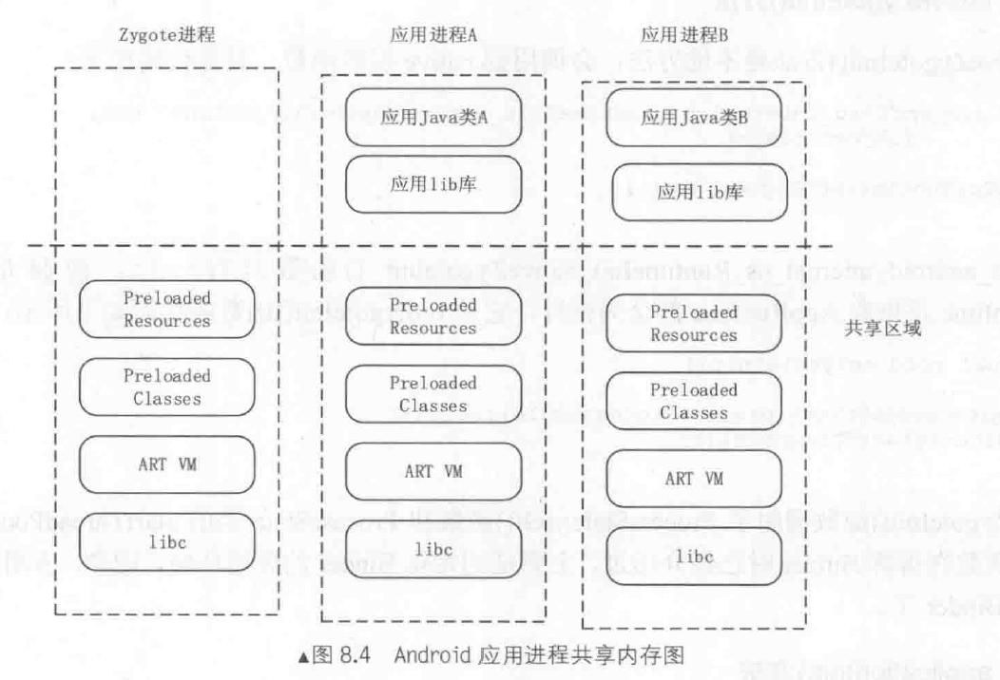

# Zygote的启动

### 面试题目：说说Zygote的启动过程，Zygote的作用是什么？

Android系统底层基于Linux内核, 当Linux启动之后，会创建init进程, init进程根据配置启动zygote进程，具体哪个配置我们不关心，怎么根据配置启动进程的我们也不关心。
我们只要知道zygote进程启动之后，会执行一个可执行文件，就像我们平时用c++写程序一样，有个Main函数作为入口，我们fork，再execve就可以了。

讲课的时候可以顺便提一提这块的原理，包括copy on write

整个调用流程如下：
首先解析传入的参数，来执行接下来的操作。
AppRuntime.start("com.android.internal.os.ZygoteInit", args, zygote);
这里zygote是true，这个AppRuntime继承自AndroidRuntime，不过这些我们不关心，我们只知道zygote启动之后执行了AndroidRuntime的start函数，

调用startVm启动虚拟机，然后调用startReg注册jni函数，然后通过jni调用callStaticVoidMethod虚拟机开始执行ZygoteInit这个java类的main函数，直到整个虚拟机退出。当前线程就是虚拟机的主线程。这样就从cpp切换到java环境了。

从5.0开始启动的是art虚拟机，加载的是libart.so了

再来看ZygoteInit的main函数，

 - registerZygoteSocket
 - preload()
 - startSystemServer(abiList, socketName);，启动systemServer进程
 - runSelectLoop(abiList);



# 实践
从native空间切换到java空间执行代码
```
public class ZygoteInit {

    public static void main(String[] args) {
        new Thread() {
            @Override
            public void run() {
                for (int i = 0; i < 10; i++){
                    System.out.println(String.format("Android is running ..."));
                    try {
                        Thread.sleep(2000);
                    } catch (InterruptedException e) {
                        e.printStackTrace();
                    }
                }
            }
        }.start();
    }
}
```

```
#include <iostream>
#include "jni.h"

using namespace std;

int main() {
    JavaVM *jvm;
    JNIEnv *env;

    JavaVMOption *options = new JavaVMOption[1];
    options[0].optionString = "-Djava.class.path=..";

    JavaVMInitArgs vm_args;
    vm_args.version = JNI_VERSION_1_8;
    vm_args.nOptions = 1;
    vm_args.options = options;
    vm_args.ignoreUnrecognized = false;

    JNI_CreateJavaVM(&jvm, (void **) &env, &vm_args);

    jclass clazz = env->FindClass("ZygoteInit");
    if (clazz != NULL) {
        jmethodID method = env->GetStaticMethodID(clazz, "main", "([Ljava/lang/String;)V");
        if (method != NULL) {
            env->CallStaticVoidMethod(clazz, method, "how");
        }
    }

    jvm->DestroyJavaVM();

    return 0;
}
```

我用的是CLION这个IDE，
```
cmake_minimum_required(VERSION 3.13)
project(test1)

find_package(JNI REQUIRED)
include_directories(${JAVA_INCLUDE_PATH})
include_directories(${JAVA_INCLUDE_PATH2})

add_executable(test1 main.cpp)

target_link_libraries(test1 ${JAVA_JVM_LIBRARY})
```

### 模拟面试
--> Zygote你了解么，
<-- 了解
--> 好，说一下它的启动过程
<-- blabla
--> 这个进程是干嘛用的
<-- 是为了创建出应用进程
--> 怎么实现的
<-- 下章再讲

